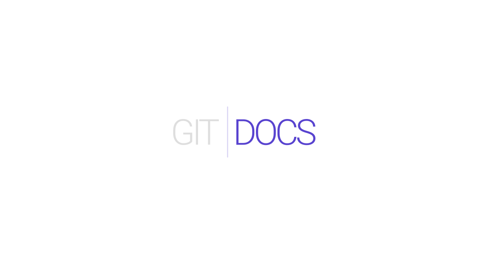

[![translate-svg]][translate-list]

GitDocs帮助您创建 美观的,SEO友好的文档站点,你的文档来源可以从源代码库的markdown文件来. 可以多个`git repos`交叉编译. 噢你还可以在本地运行,获得出色的发布体验. 

[translate-svg]: http://llever.com/translate.svg
[translate-list]: https://github.com/chinanf-boy/chinese-translate-list

---

## 校对🀄

欢迎 \`Issue\` 和 \`Pull\` ❤️, 最好 \`Pull\` 👏

> `docs`文件夹

|翻译的原文|与日期|原文更新|更多
---|---|---|---
[commit]|2018 8.9|![last commit][last]|[中文翻译][more]

[commit]:  https://github.com/timberio/gitdocs/tree/d9a11ab96041c94cbb216362d60e8e629b3aee2d
[last]: https://img.shields.io/github/last-commit/timberio/gitdocs.svg
[more]: https://github.com/chinanf-boy/chinese-translate-list

## 生活

[help me live , live need money 💰](https://github.com/chinanf-boy/live-need-money)

---

## 特征

-   语法高亮显示开箱即用. 
-   快速静态搜索所有文档. 
-   多个`git repos`交叉编译. 
-   每页的静态JSON数据. 
-   自动生成的目录. 
-   SEO友好 - 一切都是静态的!

> 噢, 有些特征没看懂, 来 [这里吧](https://gitdocs.netlify.com/)

## 示例站点

-   <https://gitdocs.netlify.com>
-   <https://docs.timber.io>
-   <https://docs.dev.to>

 
 
 

       
  
  
  
     
  <a href="https://timber.io">MIT © Timber</a>

